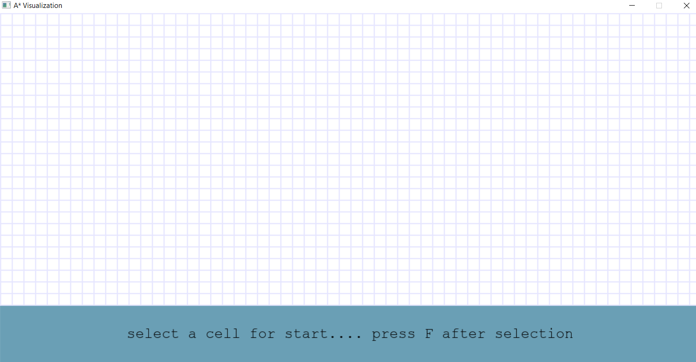
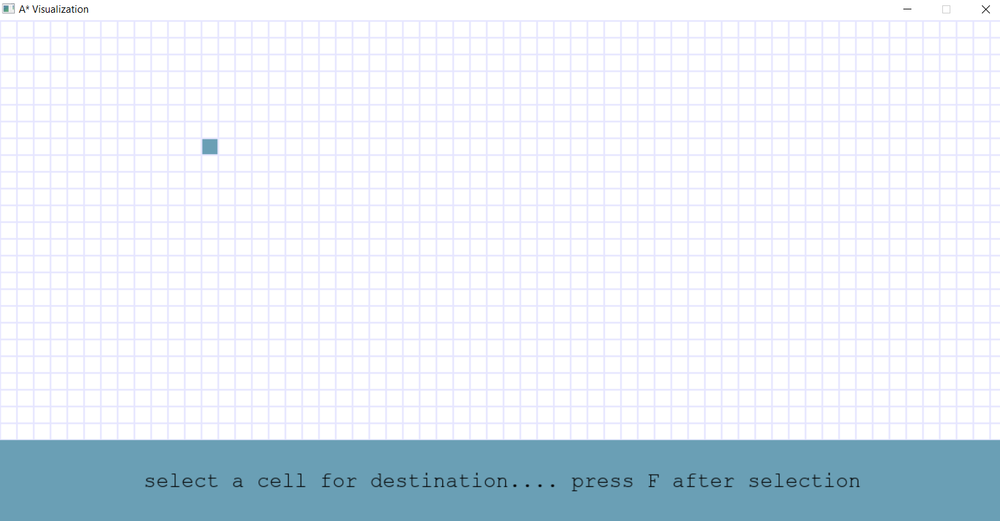
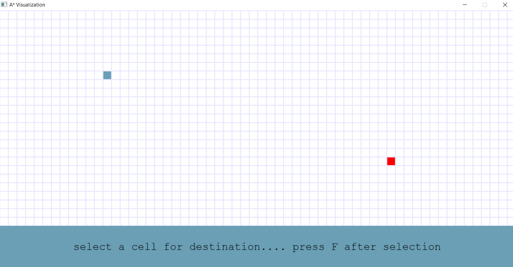
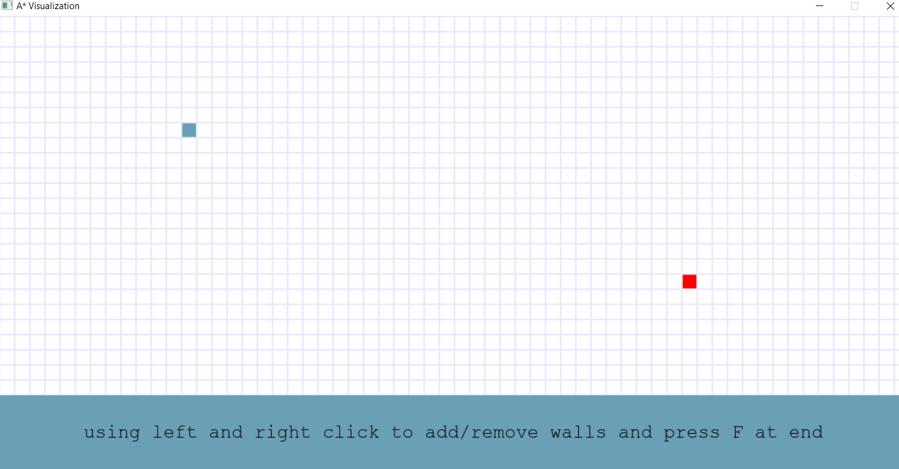
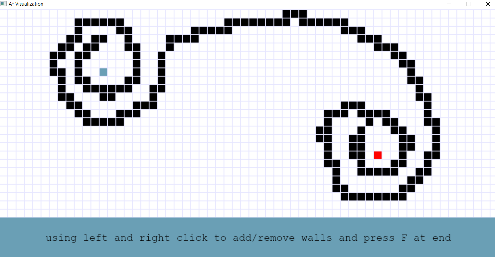
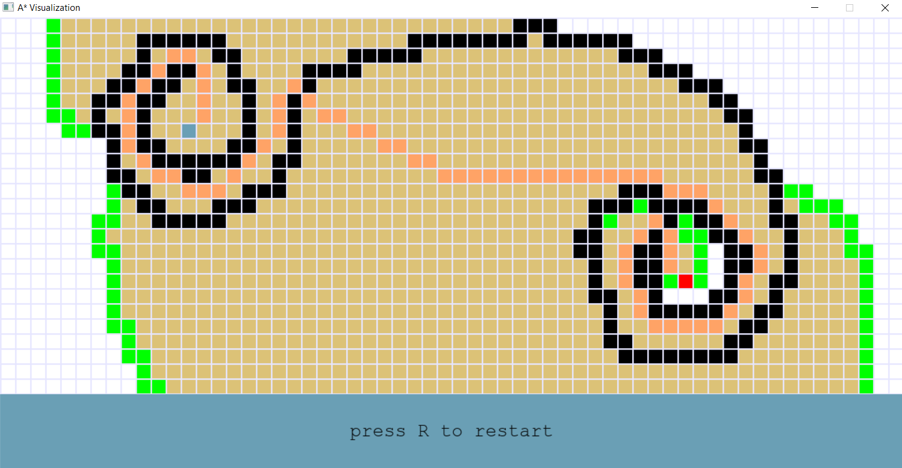

# Astar
**Astar.py** is the just the implementation of the A* algorithm ,**window.py** is the pygame program for the window ,**button.py** is the pygame program for the button to display the procedure.    
                                     
Here are the images of the illustration of the above project. 
1.window
2.selecting source
3.selecting destination
4.selecting the path of obstacle
5.The path of the abstacle is given by following the instructions shown
6.The shortest distance is shown with an orange colored path
